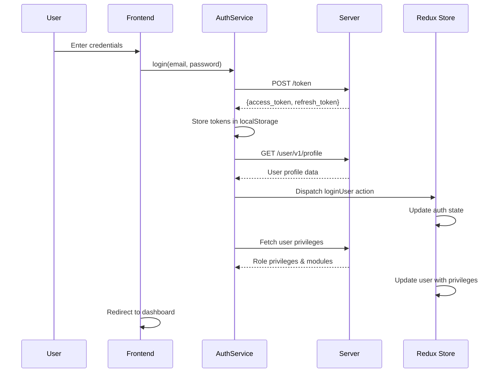

# Authentication and RBAC System Documentation

## Overview

This application implements a comprehensive Role-Based Access Control (RBAC) system with JWT-based authentication. The system provides secure user authentication, token management, and granular permission control across different modules and features.

## Table of Contents

1. [Authentication Flow](#authentication-flow)
2. [Token Management](#token-management)
3. [RBAC Architecture](#rbac-architecture)
4. [User Roles and Permissions](#user-roles-and-permissions)
5. [API Endpoints](#api-endpoints)
6. [Client-Side Implementation](#client-side-implementation)
7. [Security Features](#security-features)
8. [Configuration](#configuration)
9. [Troubleshooting](#troubleshooting)

## Authentication Flow

### 1. Login Process



### 2. Token Validation

The system uses a dual-token approach:
- **Access Token**: Short-lived (typically 15-30 minutes), used for API requests
- **Refresh Token**: Long-lived (typically 7-30 days), used to obtain new access tokens

### 3. Automatic Token Refresh

```typescript
// Token auto-refresh mechanism
class TokenAutoRefreshService {
  private async performTokenRefresh(): Promise<void> {
    const refreshToken = authService.getStoredRefreshToken();
    const newTokens = await authService.refreshToken(refreshToken);
    localStorage.setItem('auth_token', `Bearer ${newTokens.access}`);
  }
}
```

## Token Management

### Storage Strategy

- **Access Token**: Stored in `localStorage` with `Bearer` prefix
- **Refresh Token**: Stored in `localStorage` separately
- **User Data**: Cached in Redux store with localStorage fallback

### Token Lifecycle

1. **Login**: Both tokens stored after successful authentication
2. **API Requests**: Access token automatically attached to requests
3. **Token Expiry**: Automatic refresh using refresh token
4. **Refresh Failure**: User redirected to login page
5. **Logout**: All tokens cleared from storage

### Request Interceptor

```typescript
// Automatic token attachment and refresh
superAxios.interceptors.request.use(req => {
  const authToken = getAccessToken();
  if (authToken) {
    req.headers.Authorization = authToken;
  }
  return req;
});

// Automatic token refresh on 401 errors
superAxios.interceptors.response.use(
  response => response,
  async error => {
    if (error.response?.status === 401 && !originalRequest._retry) {
      // Attempt token refresh
      const newTokens = await authService.refreshToken(refreshToken);
      // Retry original request with new token
    }
  }
);
```

## RBAC Architecture

### Core Components

1. **AuthContext**: Central authentication state management
2. **AuthSlice**: Redux state for user data and authentication status
3. **SimplifiedRBACService**: Role and permission management
4. **withSimplifiedRBAC**: HOC for component-level access control

### Permission System

The RBAC system operates on three levels:

1. **Role Level**: User roles (Admin, Manager, User)
2. **Module Level**: Access to specific application modules
3. **Privilege Level**: Granular permissions within modules

### User Object Structure

```typescript
interface User {
  id: string;
  email: string;
  name: string;
  role: "admin" | "user";
  role_id: number;
  role_name: string;
  is_superuser: boolean;
  privileges: string[];           // Array of permission strings
  accessible_routes: string[];    // Array of accessible routes
  module_access: number[];        // Array of module IDs
  assigned_customers: number[];   // Customer assignments
  // ... additional user properties
}
```

## User Roles and Permissions

### Role Hierarchy

1. **Superuser** (`is_superuser: true`)
   - Full system access
   - Bypasses all permission checks
   - Can manage all users and roles

2. **Admin** (`role_id: 1`)
   - Full administrative access
   - All module permissions
   - User management capabilities

3. **Manager** (`role_id: 2`)
   - Limited administrative access
   - View and edit permissions (no delete)
   - Specific module access

4. **User** (`role_id: 3`)
   - Read-only access
   - Limited module access
   - Basic user functionality

### Module System

The application is organized into modules, each with specific privileges:

```typescript
// Example module definition
const staticModules = {
  10: { // Role Management
    name: "Role Management",
    privileges: ["CREATE_ROLE", "VIEW_ROLE_LIST", "UPDATE_ROLE", "DELETE_ROLE"],
    adminOnly: true
  },
  40: { // User Management
    name: "User Management", 
    privileges: ["CREATE_USER", "VIEW_USER_LIST", "UPDATE_USER", "DELETE_USER"],
    adminOnly: true
  },
  50: { // Container Management
    name: "Container Management",
    privileges: ["VIEW_CONTAINER_TYPES", "CREATE_CONTAINER_TYPE"],
    adminOnly: false
  }
};
```

### Permission Checking

```typescript
// Context-based permission checking
const { can, canVisit, canAccessModule, hasRole, isAdmin } = useAuth();

// Check specific privilege
if (can('CREATE_USER')) {
  // Show create user button
}

// Check route access
if (canVisit('/user-management')) {
  // Allow navigation
}

// Check module access
if (canAccessModule(40)) {
  // Show user management module
}

// Check role
if (hasRole('admin')) {
  // Admin-specific functionality
}
```

## API Endpoints

### Authentication Endpoints

| Method | Endpoint | Description | Auth Required |
|--------|----------|-------------|---------------|
| POST | `/token` | User login | No |
| POST | `/token/refresh/` | Refresh access token | No |
| GET | `/user/v1/profile` | Get user profile | Yes |

### User Management Endpoints

| Method | Endpoint | Description | Auth Required |
|--------|----------|-------------|---------------|
| POST | `/user/v1/list` | Get users list | Yes |
| GET | `/user/v1/{id}` | Get user details | Yes |
| POST | `/user/v1` | Create user | Yes |
| PUT | `/user/v1/{id}` | Update user | Yes |
| DELETE | `/user/v1/{id}` | Delete user | Yes |

### RBAC Endpoints

| Method | Endpoint | Description | Auth Required |
|--------|----------|-------------|---------------|
| GET | `/admin/v1/modules` | Get available modules | Yes |
| GET | `/admin/v1/roles` | Get roles list | Yes |
| GET | `/admin/v1/privileges` | Get privileges list | Yes |

## Client-Side Implementation

### Redux State Management

```typescript
// Auth state structure
interface AuthState {
  user: User | null;
  token: string | null;
  isAuthenticated: boolean;
  isInitialized: boolean;
  contextAvailable: boolean;
  loading: {
    auth: boolean;
    profile: boolean;
    privileges: boolean;
  };
  errors: {
    auth: string | null;
    profile: string | null;
    privileges: string | null;
  };
}
```

### Component Protection

```typescript
// HOC for component-level access control
const ProtectedComponent = withSimplifiedRBAC(MyComponent, {
  privilege: 'VIEW_USER_LIST',
  module: [40], // User Management module
  role: ['admin'],
  requireAuthentication: true,
  redirectTo: '/signin',
  fallbackComponent: AccessDenied
});
```

### Route Protection

```typescript
// Route-level access control
const protectedRoutes = {
  '/admin/user-management': {
    requiredRole: 'admin',
    requiredPrivilege: 'VIEW_USER_LIST',
    requiredModule: 40
  },
  '/user/dashboard': {
    requiredRole: ['admin', 'user'],
    requireAuthentication: true
  }
};
```

## Security Features

### 1. Token Security
- JWT tokens with proper expiration
- Automatic token refresh mechanism
- Secure token storage in localStorage
- Token validation on every API request

### 2. Permission Validation
- Server-side permission validation
- Client-side permission checking
- Role-based access control
- Module-level access restrictions

### 3. Error Handling
- Graceful token refresh failure handling
- Automatic logout on authentication failure
- Comprehensive error messages
- Network error handling

### 4. Session Management
- Automatic session timeout
- Secure logout process
- Token cleanup on logout
- Cross-tab session synchronization

## Configuration

### Environment Variables

```bash
# API Configuration
BASEURL=http://192.168.0.128:8003/api
NEXT_PUBLIC_BASE_URL=http://192.168.0.128:8003/api

# Optional: Fallback token for non-authenticated requests
NEXT_PUBLIC_TOKEN=your_fallback_token
```

### Token Configuration

```typescript
// Token refresh settings
const TOKEN_REFRESH_INTERVAL = 25 * 60 * 1000; // 25 minutes
const CACHE_DURATION = 5 * 60 * 1000; // 5 minutes for RBAC cache
```

### Module Configuration

Modules are defined in `src/config/staticModules.ts`:

```typescript
export const staticModules: Record<number, StaticModule> = {
  // Module definitions with privileges and routes
};
```

## Troubleshooting

### Common Issues

1. **Token Refresh Failures**
   - Check refresh token validity
   - Verify server connectivity
   - Check token expiration settings

2. **Permission Denied Errors**
   - Verify user role assignments
   - Check privilege configurations
   - Ensure module access permissions

3. **Authentication State Issues**
   - Clear localStorage and Redux state
   - Check token format and validity
   - Verify API endpoint accessibility

### Debug Tools

```typescript
// Check current authentication state
console.log('Auth State:', useAppSelector(selectAuth));
console.log('User:', useAppSelector(selectUser));
console.log('Token:', getAccessToken());

// Check RBAC permissions
const { can, canVisit, canAccessModule } = useAuth();
console.log('Can create user:', can('CREATE_USER'));
console.log('Can visit user management:', canVisit('/user-management'));
```

### Logging

The system includes comprehensive logging for debugging:

```typescript
// Authentication logs
console.log('🔍 AuthService: Verifying token and fetching profile...');
console.log('✅ AuthService: Token verified and profile fetched successfully');
console.log('❌ AuthService: Token verification failed:', error);

// RBAC logs
console.log('📁 Using static data for mock user');
console.log('📡 Using server role data:', serverData);
```

## Best Practices

1. **Always check permissions before rendering sensitive components**
2. **Use the HOC pattern for component-level protection**
3. **Implement proper error boundaries for authentication failures**
4. **Regularly audit user permissions and role assignments**
5. **Monitor token refresh patterns for security issues**
6. **Use environment variables for API configuration**
7. **Implement proper logout cleanup procedures**

## Security Considerations

1. **Token Storage**: Tokens are stored in localStorage (consider httpOnly cookies for production)
2. **HTTPS**: Ensure all API communication uses HTTPS
3. **Token Expiration**: Implement appropriate token expiration times
4. **Permission Validation**: Always validate permissions on the server side
5. **Audit Logging**: Consider implementing audit logs for sensitive operations
6. **Rate Limiting**: Implement rate limiting for authentication endpoints

---

This documentation provides a comprehensive overview of the authentication and RBAC system. For specific implementation details, refer to the source code in the respective service files.
